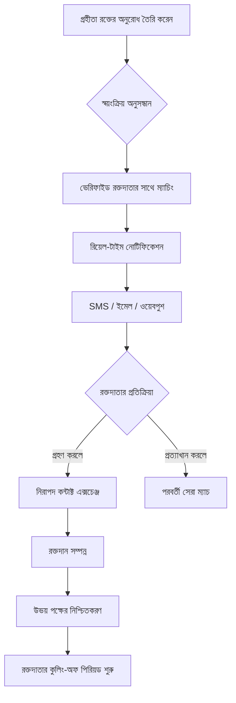

# প্রজেক্ট রক্ত: বাংলাদেশের জন্য সার্বভৌম রক্তদান নেটওয়ার্ক

[English README](./README.md)

প্রজেক্ট রক্ত একটি সম্প্রদায়-চালিত, গোপনীয়তা-প্রথম এবং অত্যন্ত স্থিতিস্থাপক রক্তদান প্ল্যাটফর্ম যা বিশেষভাবে বাংলাদেশের অনন্য প্রয়োজনের জন্য ডিজাইন করা হয়েছে। এটি সম্প্রদায়ের দ্বারা, সম্প্রদায়ের জন্য তৈরি করা হয়েছে এবং অটোমেশন, স্বচ্ছতা এবং বিকেন্দ্রীকরণের মাধ্যমে জরুরি রক্ত অনুসন্ধানের বিশৃঙ্খলা দূর করার লক্ষ্য রাখে।

## 🌟 আমাদের লক্ষ্য (Our Vision)

একটি **নিখুঁত রক্তদান প্রযুক্তি** তৈরি করা: একটি সম্পূর্ণ কার্যকর, নিরাপদ এবং গোপনীয়তা-বান্ধব প্ল্যাটফর্ম যা বাংলাদেশের প্রতিটি নাগরিকের সেবা করবে। আমরা বিশ্বাস করি যে জীবন রক্ষাকারী অবকাঠামো ওপেন-সোর্স হওয়া উচিত এবং কোনো কেন্দ্রীয় নিয়ন্ত্রণের বাধা ছাড়াই সরাসরি মানুষের উপকারে আসা উচিত।

---

## 🛑 যেসব সমস্যার আমরা সমাধান করছি

রক্তদানের ক্ষেত্রে বাংলাদেশ কিছু অনন্য চ্যালেঞ্জের সম্মুখীন হয়। প্রজেক্ট রক্ত আধুনিক ইঞ্জিনিয়ারিংয়ের মাধ্যমে এগুলোর সমাধান করে:

### ১. বিচ্ছিন্নতা এবং ম্যানুয়াল অদক্ষতা

বাংলাদেশের বেশিরভাগ রক্তদান সংস্থা ম্যানুয়াল বা সাধারণ ডিজিটাল প্রক্রিয়ার (যেমন স্প্রেডশীট) মাধ্যমে তাদের কার্যক্রম পরিচালনা করে। একটি শক্তিশালী ডিজিটাল প্ল্যাটফর্মের অভাবে দক্ষভাবে রক্তদাতা ব্যবস্থাপনা বা জরুরি তথ্য বিতরণ প্রায় অসম্ভব হয়ে পড়ে।

- **রক্ত সমাধান:** আমরা একটি আধুনিক ডিজিটাল ব্যাকবোন প্রদান করি যা রক্তদাতা ব্যবস্থাপনাকে স্বয়ংক্রিয় করে, ফলে প্রতিটি সংস্থা সর্বোচ্চ দক্ষতায় কাজ করতে পারে।

### ২. তথ্যের বিচ্ছিন্নতা এবং মানসিক চাপ

বর্তমানে বেশ কিছু প্ল্যাটফর্ম থাকলেও সেগুলো ফেসবুক পেজ, টেলিগ্রাম চ্যানেল বা ব্যক্তিগত ওয়েবসাইটে ছড়িয়ে ছিটিয়ে আছে। জীবনের সবচেয়ে চাপের মুহূর্তে, গ্রহীতাদের এই বিচ্ছিন্ন জায়গাগুলোতে নেভিগেট করতে হিমশিম খেতে হয়।

- **রক্ত সমাধান:** একটি সমন্বিত কেন্দ্রীয় সার্চ ইঞ্জিন এবং ডাটাবেস। সারা দেশে রক্তদাতা খুঁজে পাওয়ার একটি নির্দিষ্ট জায়গা, যা জরুরি অবস্থায় বিভিন্ন প্ল্যাটফর্মে খোঁজাখুঁজির ভোগান্তি কমায়।

### ৩. বিকেন্দ্রীকরণ বনাম স্কেলিং

একটি দেশব্যাপী ডাটাবেস পরিচালনার জন্য বিশাল জনশক্তির প্রয়োজন হয়। ম্যানুয়াল ভেরিফিকেশন এবং ম্যাচিং ধীরগতির হয়ে থাকে, যা অনেক সময় জীবনের ঝুঁকি বাড়িয়ে দেয়।

- **রক্ত সমাধান:** আমরা একটি **বিকেন্দ্রীভূত ব্যবস্থাপনা মডেল** বাস্তবায়ন করি। সংস্থাগুলো নেটওয়ার্কের মধ্যে স্বাধীনভাবে কাজ করতে পারে, আর আমাদের স্বয়ংক্রিয় অ্যালগরিদমগুলো কোনো মানুষের হস্তক্ষেপ ছাড়াই রক্তদাতার যোগ্যতা পরীক্ষা এবং ম্যাচিংয়ের কাজ সম্পন্ন করে।

### ৪. স্থানীয় স্থিতিস্থাপকতা (Local Resilience)

বিদ্যমান সমাধানগুলো আন্তর্জাতিক সোশ্যাল মিডিয়া প্ল্যাটফর্মের ওপর অনেক বেশি নির্ভরশীল। প্রাকৃতিক দুর্যোগ, সাবসি কেবল সমস্যা বা জাতীয় সংকটের সময় এই প্ল্যাটফর্মগুলো ধীর বা সম্পূর্ণ বিচ্ছিন্ন হয়ে যেতে পারে।

- **রক্ত সমাধান:** এটি **লোকাল রেজিলিয়েন্স** বা স্থানীয় স্থিতিস্থাপকতার জন্য বিশেষভাবে তৈরি। প্রজেক্ট রক্ত **BDIX হোস্টিং** এবং স্থানীয় ISP কানেক্টিভিটির জন্য অপ্টিমাইজড। ফলে আন্তর্জাতিক ইন্টারনেট সংযোগ বিচ্ছিন্ন থাকলেও এটি বাংলাদেশের ভেতরে সচল থাকে।

### ৫. নোটিফিকেশন ব্ল্লাইন্ডনেস

সোশ্যাল মিডিয়া পোস্ট বা ইমেল অ্যালার্টের ওপর নির্ভর করা এখন আর কার্যকর নয়। অ্যালগরিদম অনেক সময় জরুরি পোস্টগুলো নিচে নামিয়ে দেয় এবং ইমেল প্রায়ই নজর এড়িয়ে যায়।

- **রক্ত সমাধান:** **মাল্টি-চ্যানেল অ্যালার্ট**। আমরা সরাসরি রক্তদাতার ডিভাইসে **SMS, ইমেল এবং ওয়েবপুশ (WebPush)** নোটিফিকেশন পাঠাই, যা দ্রুত সাড়া পেতে সাহায্য করে।

### ৬. গোপনীয়তা এবং নিরাপত্তা

বর্তমানে এমন কোনো প্ল্যাটফর্ম নেই যা নিরাপত্তার পাশাপাশি ব্যবহারকারীর গোপনীয়তা সম্পূর্ণভাবে রক্ষা করে।

- **রক্ত সমাধান:** **প্রাইভেসি-ফার্স্ট আর্কিটেকচার**। এনআইডি-ভিত্তিক ভেরিফিকেশন, নিরাপদ কন্টাক্ট এক্সচেঞ্জ প্রোটোকল এবং অ্যাক্সেস লগিংয়ের মাধ্যমে আমরা নিশ্চিত করি যে আপনার ডাটা সম্পূর্ণ নিরাপদ।

---

## 🔄 সিস্টেম ওয়ার্কফ্লো (System Workflow)

---

## 🛠 টেক স্ট্যাক (Tech Stack)

কর্মক্ষমতা, আধুনিক ফিচার এবং দীর্ঘমেয়াদী রক্ষণাবেক্ষণের জন্য আমাদের এই স্ট্যাকটি বেছে নেওয়া হয়েছে:

- **ব্যাকএন্ড:** Python 3.14 এবং Django 6.0
- **ডাটাবেস:** PostgreSQL (PostGIS সহ)
- **রিয়েল-টাইম:** Redis
- **ইন্টারফেস:** Django Unfold (আধুনিক অ্যাডমিন), Bootstrap 5 (SASS কাস্টমাইজড)
- **সিকিউরিটি:** Argon2-cffi হ্যাশিং, সিকিউর UUID টোকেন
- **ডেভঅপস:** Docker-ready, BDIX অপ্টিমাইজড

---

## 🤝 মিশনে যোগ দিন

আমরা বাংলাদেশের **সেরা ডেভেলপারদের** একত্রিত করছি এই প্ল্যাটফর্মটি তৈরি করতে। আপনি ব্যাকএন্ড আর্কিটেক্ট, সিএসএস উইজার্ড বা সিকিউরিটি বিশেষজ্ঞ যাই হোন না কেন, আপনার অবদান জীবন বাঁচাতে সাহায্য করতে পারে।

### কীভাবে অবদান রাখবেন

১. **Fork & Clone:** `uv` ব্যবহার করে কোডবেসটি লোকাললি সেটআপ করুন।
২. **Explore:** আর্কিটেকচারাল গাইডেন্সের জন্য `AGENTS.md` এবং `CLAUDE.md` দেখুন।
৩. **Build:** `just` ব্যবহার করে ডেভেলপমেন্ট শুরু করুন (`just up`, `just migrate`, `just test`) ।
৪. **Submit:** আপনার ইমপ্রুভমেন্ট সহ একটি পুল রিকোয়েস্ট (PR) ওপেন করুন।

> "সম্প্রদায়ের জন্য এবং সম্প্রদায়ের দ্বারা একটি প্রজেক্ট।"

---

## 📄 লাইসেন্স

এই প্রজেক্টটি **GNU GPLv3 লাইসেন্সের** অধীনে লাইসেন্সপ্রাপ্ত। একটি কমিউনিটি প্রজেক্ট হিসেবে, আমরা কোড সবার জন্য উন্মুক্ত রাখতে বিশ্বাস করি।

---

_বাংলাদেশে ❤️ সহ তৈরি।_
