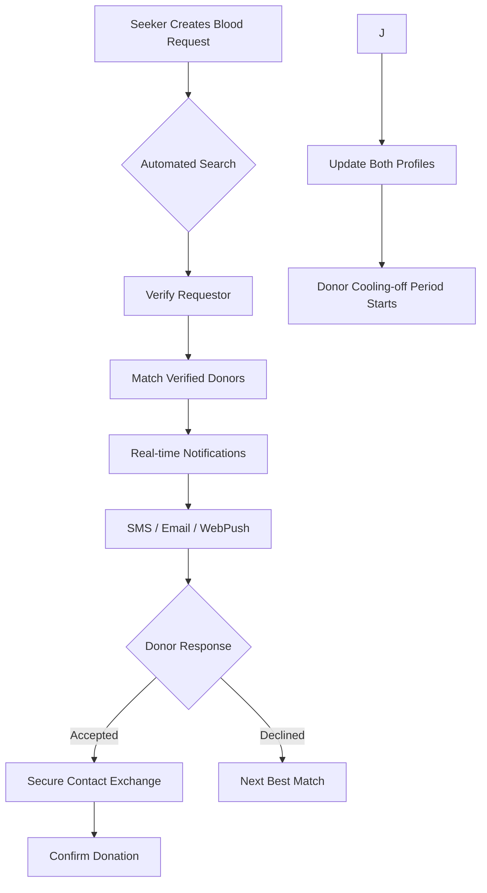

# Project Rokto: The Sovereign Blood Donation Network for Bangladesh

[বাংলা সংস্করণ](./README.bn.md)

Project Rokto is a community-driven, privacy-first, and highly resilient blood donation platform designed specifically for the unique needs of Bangladesh. Built by the community, for the community, it aims to eliminate the chaos of emergency blood searches through automation, transparency, and decentralization.

## 🌟 Our Vision

To build the **pinnacle of blood donation technology**: a perfectly working, safe, secure, and privacy-friendly platform that serves every citizen in Bangladesh. We believe that life-saving infrastructure should be open-source, community-owned, and free from the bottlenecks of centralized manual processes.

---

## 🛑 Challenges We Tackle

Bangladesh faces unique challenges in the noble act of blood donation. Project Rokto is architected to solve these through modern engineering:

### 1. Fragmentation and Manual Inefficiency

Most blood donation organizations in Bangladesh manage their noble cause using paper records or manual digital processes (like simple spreadsheets). This lack of a robust digital platform makes it nearly impossible to manage donors efficiently or distribute urgent information to those in need.

- **Solution:** We provide a sophisticated digital backbone that automates donor management, ensuring that every organization has the tools to operate at peak efficiency.

### 2. Information Silos and Cognitive Load

While some proprietary platforms exist, they are scattered across individual websites, Facebook pages, and Telegram channels. In the most stressful moments of their lives, seekers are forced to recall and navigate these fragmented silos.

- **Solution:** A unified central search engine and database. One place to find donors across the entire country, eliminating the struggle of navigating multiple platforms during emergencies.

### 3. Centralization vs. Scaling

A centralized organization managing a nationwide database requires massive human resources to remain accurate. Manual verification and matching become bottlenecks that cost lives.

- **Solution:** We implement a **decentralized management model**. Organizations can operate independently within the network, while our automated algorithms handle repeatable tasks like eligibility checking and donor matching without human delay.

### 4. Lack of Local Resilience

Most current solutions rely heavily on international social media platforms. During natural disasters (subsea cable damage), national unrest, or international crises, these platforms can become degraded or completely inaccessible.

- **Solution:** Engineered for **Local Resilience**. Project Rokto is optimized for **BDIX hosting** and local ISP connectivity. This ensures that the platform remains highly available within Bangladesh even when international internet connectivity is compromised.

### 5. Notification Blindness

Relying on social media posts or email alerts is no longer effective. Algorithms bury urgent posts, and emails are often ignored or delayed.

- **Solution:** **Urgent, Multi-Channel Alerts**. We bypass the algorithms by providing automated, real-time **SMS, Email, and WebPush** alerts directly to eligible donors' devices the moment a request is verified.

### 6. Privacy and Security Gaps

Currently, there is no platform that guarantees robust security verification while maintaining complete user privacy. Donors and seekers deserve a solution where they can participate in this noble act without fearing data breaches or unwanted exposure.

- **Solution:** **Privacy-First Architecture**. With NID-based verification, secure contact exchange protocols (revealed only upon mutual acceptance), and comprehensive access logging, we ensure that your data is as safe as the lives you are helping to save.

---

## 🔄 System Workflow

---

## 🛠 Tech Stack

Our stack is chosen for performance, modern features, and long-term maintainability.

- **Backend:** Python 3.14 & Django 6.0 (Aspirational, Cutting-edge)
- **Database:** PostgreSQL with Geopy for location-aware donor matching
- **Real-time:** Redis for task queuing and notification delivery
- **Interface:** Django Unfold (Modern Admin), Bootstrap 5 (SASS customized)
- **Security:** Argon2-cffi hashing, secure UUID tokens for contact access
- **DevOps:** Docker-ready, optimized for local BDIX deployment

---

## 🤝 Join the Mission

We are bringing together the **best Bangladeshi developers** to build this pinnacle solution. Whether you are a backend architect, a CSS wizard, or a security expert, your contribution can save lives.

### How to Contribute

1. **Fork & Clone:** Get the codebase locally using `uv`.
2. **Explore:** Check `AGENTS.md` and `CLAUDE.md` for architectural guidance.
3. **Build:** Use `just` for a streamlined development workflow (`just up`, `just migrate`, `just test`).
4. **Submit:** Open a Pull Request with your improvements.

> "A project for the community and by the community."

---

## 📄 License

This project is licensed under the **GNU GPLv3 License**. As a community project, we believe in keeping the code open and free for everyone.

---

_Built with ❤️ in Bangladesh._
